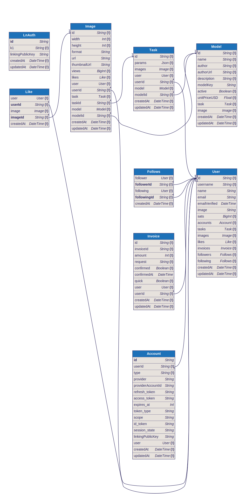

<h1 align="center">Welcome to Micropay Server👋</h1>

<div align="center">

[]()
[](https://github.com/dillionverma/lightning-sms-server/issues)
[](https://github.com/dillionverma/lightning-sms-server/pulls)
[](/LICENSE)

</div>

---

<p align="center"> Few lines describing your project.
    <br> 
</p>

## 📝 Table of Contents

- [Install](#✨-install)
- [Usage](#✅-usage)
- [Develop](#👨‍💻-develop)
- [Docker](#🚀-docker)
- [Test](#🔧-test)
- [Authors](#👤-authors)
- [Database Schema Diagram](#🗺️-diagram)

## ✨ Install

```sh
yarn install
```

## ✅ Usage

```sh
yarn start
```

## 👨‍💻 Develop

Hot reloading enabled

```sh
yarn dev
```

## 🚀 Docker

```sh
docker compose up --build
```

## 🔧 Test

```sh
yarn test
```

## Database Schema



## 👤 Authors

- **Dillion Verma**

## License

[MIT](https://choosealicense.com/licenses/mit/)
